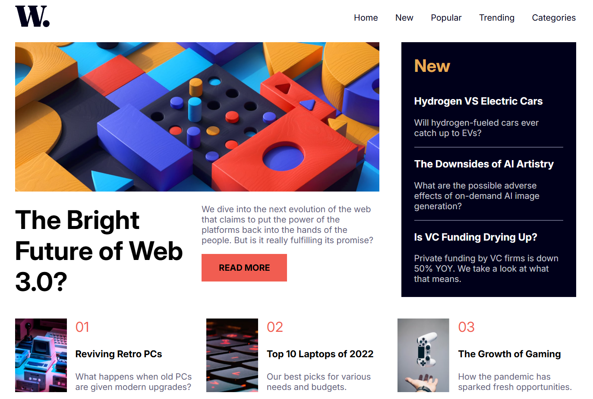

# Frontend Mentor - News homepage solution

This is a solution to the [News homepage challenge on Frontend Mentor](https://www.frontendmentor.io/challenges/news-homepage-H6SWTa1MFl). Frontend Mentor challenges help you improve your coding skills by building realistic projects.

## Table of contents

- [Overview](#overview)
  - [Screenshot](#screenshot)
  - [Links](#links)
- [My process](#my-process)
  - [Built with](#built-with)
  - [What I learned](#what-i-learned)
- [Author](#author)

## Overview

### Screenshot

### Links

Live Site URL: [Vercel](https://frontend-contact-form-wheat.vercel.app/)

## My process

### Built with

- Semantic HTML5 markup
- CSS custom properties
- CSS Flex
- CSS Grid
- Mobile-first workflow
- SCSS
- JS

### What I learned

- Familiarizing with CSS Flex and Grid
- CSS BEM (Block Element Modifier) structure attempt
- Usage of SCSS
- Mobile-first styling
- Usage of css inset for mobile nav
- Usage of + (adjacent sibling selector) to apply border for all following items except the first item
- Usage of various ARIA attributes

## Author

- Frontend Mentor - [@RemiPish](https://www.frontendmentor.io/profile/RemiPish)
